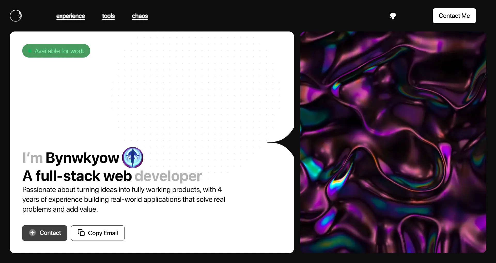

# Bynwkyow Portfolio - Open Source Template

A modern, responsive portfolio website built with **SolidJS** and **Tailwind CSS**. This project serves as both a personal portfolio for Bynwkyow and an open-source template that anyone can use to create their own professional portfolio.



## Features

- **Modern Design**: Clean, minimalist design with smooth animations and transitions
- **Responsive Layout**: Fully responsive design that works on all devices
- **Fast Performance**: Built with SolidJS for optimal performance and small bundle size
- **Customizable**: Easy to customize colors, content, and styling
- **SEO Optimized**: Built with best practices for search engine optimization
- **Dark/Light Theme Support**: Built-in theme switching capabilities
- **Smooth Animations**: CSS animations and transitions for enhanced user experience

## Tech Stack

- **Frontend Framework**: [SolidJS](https://www.solidjs.com/) - A declarative JavaScript UI library
- **Build Tool**: [Vinxi](https://vinxi.vercel.app/) - Universal build tool for modern web apps
- **Styling**: [Tailwind CSS](https://tailwindcss.com/) - Utility-first CSS framework
- **Routing**: [@solidjs/router](https://github.com/solidjs/solid-router) - Official router for SolidJS
- **Code Quality**: [Biome](https://biomejs.dev/) - Fast formatter and linter
- **Package Manager**: [Bun](https://bun.sh/) - Fast JavaScript runtime and package manager

## Sections

The portfolio includes several key sections:

1. **Hero Section** - Introduction and call-to-action
2. **About** - Professional summary and experience
3. **Tools & Technologies** - Skills and frameworks showcase
4. **Experience** - Work history and achievements
5. **Projects** - Featured projects (like Chaos Skin Manager)
6. **Contact** - Easy ways to get in touch

## Getting Started

### Prerequisites

- **Node.js** 22.0.0 or higher
- **Bun** (recommended) or **npm**/**yarn**

### Installation

1. **Clone the repository**
   ```bash
   git clone https://github.com/bynwkyow/bynwkyowprofile.git
   cd bynwkyowprofile
   ```

2. **Install dependencies**
   ```bash
   # Using Bun (recommended)
   bun install
   
   # Or using npm
   npm install
   
   # Or using yarn
   yarn install
   ```

3. **Start development server**
   ```bash
   # Using Bun
   bun run dev
   
   # Or using npm
   npm run dev
   
   # Or using yarn
   yarn dev
   ```

4. **Open your browser**
   Navigate to `http://localhost:5173` to see your portfolio

### Building for Production

```bash
# Build the project
bun run build

# Start production server
bun run start
```

## Customization

### Personal Information

Update your personal information in `src/const.ts`:

```typescript
export const EMAIL = "your-email@example.com";

export const EXPERIENCES = [
  {
    icon: "/experiences/company-logo.png",
    org: "Your Company",
    title: "Your Position",
    date: "2024",
    description: "Your role description and achievements."
  },
  // Add more experiences...
];

export const DOWNLOAD_URL = "https://your-project-link.com";
```

### Styling

- **Colors**: Modify the color scheme in `src/app.css` and component files
- **Fonts**: Replace the SF Pro Display fonts in `public/fonts/` with your preferred fonts
- **Layout**: Adjust spacing and layout in the component files
- **Animations**: Customize animations in `src/app.css`

### Content

- **Profile Picture**: Replace `public/pfp.webp` with your own image
- **Background**: Update `public/bg.webp` with your preferred background
- **Projects**: Add your own projects to the portfolio
- **Skills**: Update the tools and technologies section in `src/routes/tools.tsx`

### Navigation

Customize the navigation menu in `src/components/Nav.tsx`:

```typescript
const NAV_ITEMS = [
  { label: "Home", to: "/" },
  { label: "About", to: "/about" },
  { label: "Projects", to: "/projects" },
  { label: "Contact", to: "/contact" },
];
```

## Project Structure

```
bynwkyowprofile/
├── public/                 # Static assets
│   ├── fonts/             # Custom fonts
│   ├── tools/             # Technology icons
│   ├── experiences/       # Company logos
│   └── images/            # Other images
├── src/
│   ├── components/        # Reusable components
│   │   ├── Layout.tsx     # Main layout wrapper
│   │   ├── Nav.tsx        # Navigation component
│   │   └── Tool.tsx       # Technology tool component
│   ├── routes/            # Page components
│   │   ├── index.tsx      # Home page
│   │   ├── experience.tsx # Experience page
│   │   ├── tools.tsx      # Tools & technologies page
│   │   └── chaos.tsx      # Project showcase page
│   ├── app.tsx            # Main app component
│   ├── app.css            # Global styles
│   └── const.ts           # Constants and data
├── package.json            # Dependencies and scripts
├── tsconfig.json          # TypeScript configuration
└── README.md              # This file
```

## Available Scripts

- `bun run dev` - Start development server
- `bun run build` - Build for production
- `bun run start` - Start production server
- `bun run lint` - Run linting (if configured)
- `bun run format` - Format code (if configured)

## Features in Detail

### Responsive Design
- Mobile-first approach
- Breakpoint-based responsive layouts
- Optimized for all screen sizes

### Performance
- SolidJS for optimal rendering
- Tailwind CSS for minimal CSS output
- Optimized images and assets

### Accessibility
- Semantic HTML structure
- Proper ARIA labels
- Keyboard navigation support

### SEO
- Meta tags and descriptions
- Structured data markup
- Fast loading times

## Contributing

We welcome contributions! Here's how you can help:

1. **Fork the repository**
2. **Create a feature branch** (`git checkout -b feature/amazing-feature`)
3. **Commit your changes** (`git commit -m 'Add some amazing feature'`)
4. **Push to the branch** (`git push origin feature/amazing-feature`)
5. **Open a Pull Request**

### Contribution Guidelines

- Follow the existing code style
- Add tests for new features
- Update documentation as needed
- Be respectful and inclusive

## License

This project is licensed under the **MIT License** - see the [LICENSE](LICENSE) file for details.

## Acknowledgments

- **SolidJS Team** for the amazing framework
- **Tailwind CSS** for the utility-first CSS framework
- **Vinxi** for the build tool
- **Bun** for the fast JavaScript runtime
- **[Eudrino](https://github.com/itsmeeudrino)** for the original design and development
- **[Bynwkyow](https://github.com/bynwkyow)** for the portfolio content and customization

## Support

If you have any questions or need help:

- **Create an issue** on GitHub
- **Email**: bynwkyow@gmail.com
- **Discord**: [Join our community](https://discord.gg/ZFmmzMJGra)

## Show Your Support

If you find this portfolio template helpful, please consider:

- **Starring** this repository
- **Linking** to it in your projects
- **Sharing** it with other developers
- **Buying me a coffee** (if you're feeling generous)

---

**Made with love by [Eudrino](https://github.com/itsmeeudrino) & [Bynwkyow](https://github.com/bynwkyow)**

*Feel free to use this template for your own portfolio! Just remember to give credit where it's due.*
